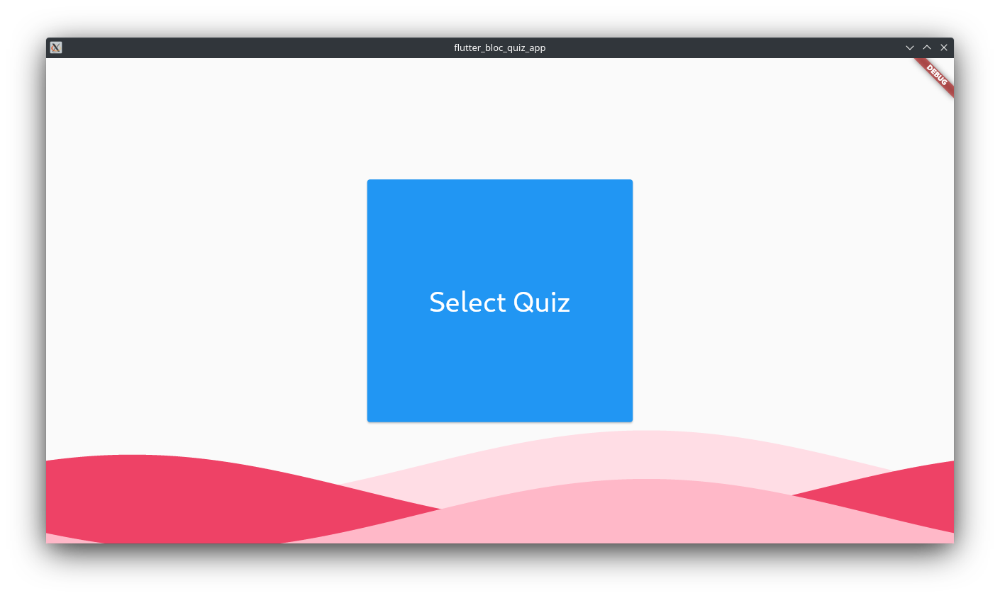
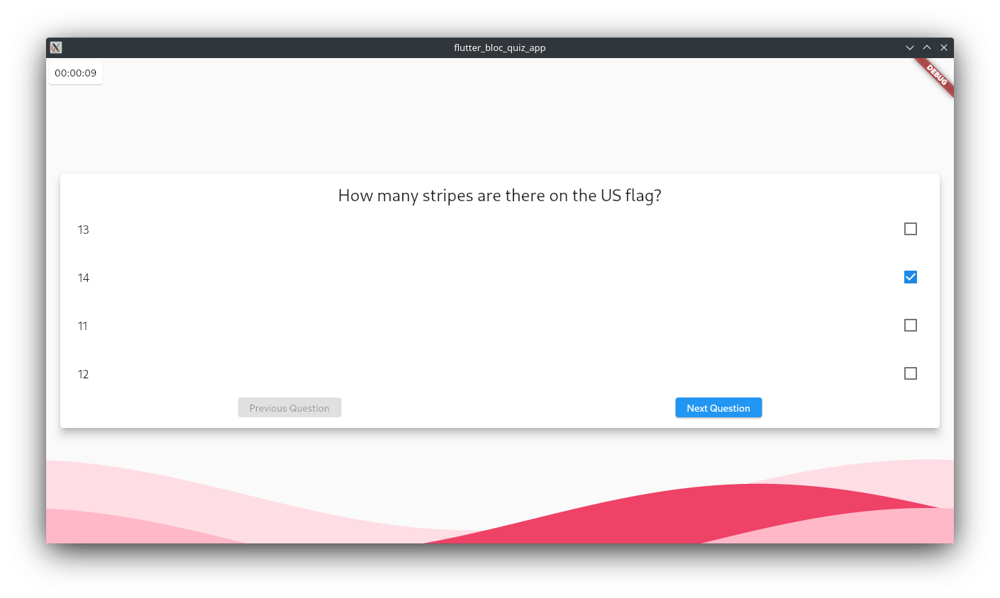
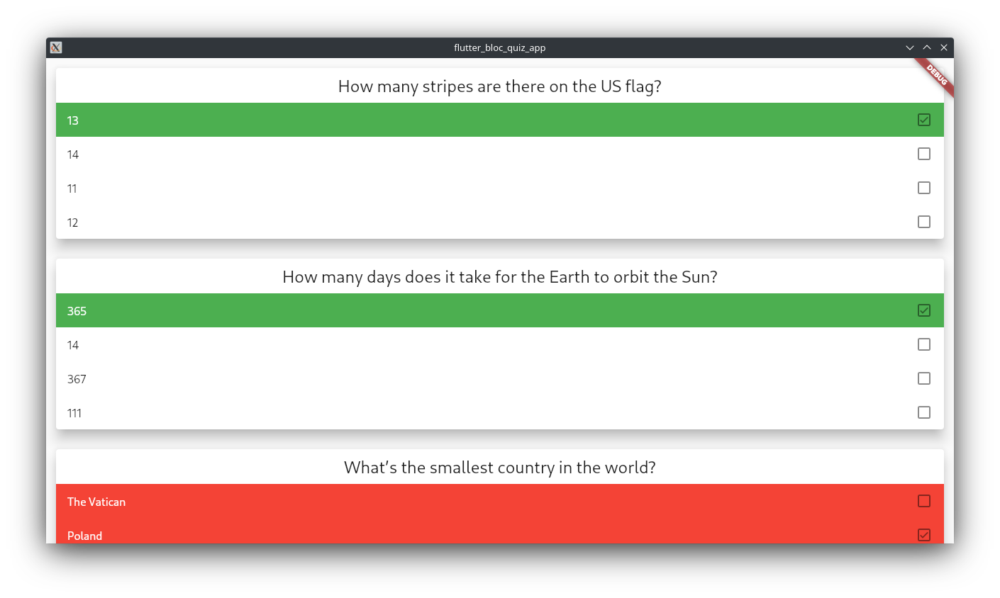

# flutter_bloc_quiz_app

Simple desktop quiz app made to practice flutter skills, and as a solution for a college task.
Quiz files are stored in .json format, encrypted with a simple caesar cipher, with an offset of 1 character.

## Used packages: 
    Packages currently added to pubspec.yaml (They might not be used, as of right now, but will probably be used in future):
    * file_picker: ^4.5.1
    * flutter_bloc: ^8.0.1
    * freezed: ^1.1.0
    * equatable: ^2.0.3
    * build_runner: ^2.1.8
    * json_serializable: ^6.1.5
    * json_annotation: ^4.4.0
    * bloc_test: ^9.0.3
    * test: ^1.19.5

## Preview

